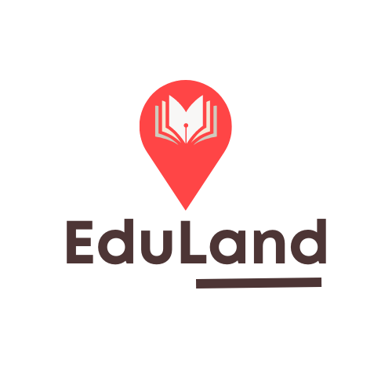

# HACKATHON-by-SAYNA_EduLand

Repository pour les rendus des pitch du HackathonBySayna

## LES MEMBRES DE L'EQUIPE

@mitsinjou
@Rakotozonirina
@HendryDi
@RAHAJANIRINA

"Pour la mobilité durable des savoirs"

## LES BRANCHES DU REPOSITORY

### MAIN

Ici ont été "pushé" tous les pitch et presentation qui nous ont servi pour le Hackathon

### MASTER

Ici ont été mis le code source du MVP du site vitrine de EduLand
(Edit aujourd'hui 30 Juillet: A la dernière minute, nous avons eu un problème de deploiement de ce site pour le MVP)

### ASSETS

Tous les assets qui ont été utilisé pour le developpement du MVP

## PROCESS DE FONCTIONNEMENT DE L'EQUIPE

### decouverte:

developpement du business model

### orientation:

developpement du design qu'on peut retrouver dans la branch main

### specialisation:

nous avons fait le choix de developper a la fois un site par wordpress et un autre via developpement web (code)

### NOTE:

Vu que le deploiement du site developpé par code a eu un problème dernière minute, notre de pitch de specialisation se concentrera sur celui sur wordpress

## RESUME TEXTE DU PROJET

### PROBLEMATIQUE IDENTIFIEE

L'idée par d'un constat: la plupart des formations ou d'évènements de qualité sont concentrés à la capitale! Je viens d'ailleurs d'experimenter la problématique ayant été obligé de monter sur Tananarive pour participer à des formations qui m'interessaient énormement dans le domaine dont j'investis en ce moment et que j'avais besoin d'un réseau solide et concret pour avancer dans mes projets.

### SOLUTION PROPOSEE

Je suis convaincu que pour une économie locale prospère et pour avoir des jeunes compétitifs dans le monde professionnel ayant des compétences et des références variées: la mobilité des connaissances, un réseautage solide basé sur des échanges interactifs en présentiel restent d'actualité!

Je suis ainsi convaincu que le présentiel n'est pas mort et reste un outil d'une grande valeur et qu'il nous appartient de donner la possibilité à tous formateurs/consultants/entreprises/associations et autres acteurs de pouvoir proposer leurs préstations partout à Madagascar au moindre coût via des liens de partenariat de confiance que nos mettrons en place.

### VISION DU PROJET

EduLand sera, à terme, une plateforme de mise en relation entre des personnes en recherche de formation partout à Madagascar et des personnes ressources/ entreprises/associations qui detiennent ses compétences et qui ont envie de les partager mais qui ne peuvent se déplacer par faute de moyens ou par méconnaissances des localités cibles.
[11:33]

### MISSION DU PROJET

EduLand sera donc une entreprise qui servira d'intermediaire entre les demandeurs de formations et ceux qui offrent ces formations.
Pour celà, sera mis en place une logistique pour offrir aux clients, cités plus haut, la possibilité de jouir d'offres à bas coût de nos futurs partenaires (hotels, restaurants, salles de conférence, et autres presataires) à qui nous nous assureront de la durabilité du projet d'entreprise. Ces clients bénéficieront de la meilleure prestation possible selon leurs budgets.

### CONCRETEMENT

Ici, le numérique ne peut être mis de côté car pour pouvoir présenter efficacement notre prestation aux clients, il faut être présent dans des canaux pertinents au projet: Site web vitrine des offres possibles et demandes de devis, Blog, réseaux sociaux dont LinkedIn et Facebook

### LES IMPACTS

- Mobilité des connaissances,
- interactivité des échanges et réseautage solide pour de futurs collaborations professionnelles,
- développement des économies locales,
- Amélioration de la compétitivité / employabilité des jeunes sur le monde du travail par l'accès des formations diverses et de tous horizons,
- Par extension, développement du tourisme local.

